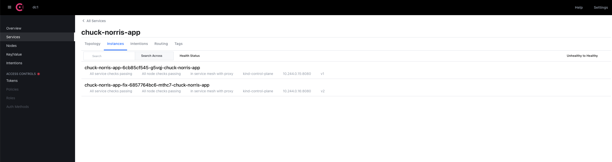

## Introduction

In this part you will perform the following tasks:

- Deploy Chuck Norris app
- Make Chuck Norris app part of Consul Service Mesh
- Test the application

## Deploy Apps

In this chapter we will deploy Chuck Norris app. We will not only deploy the application but we will deploy it with Envoy sidecar.

Envoy is a high-performance proxy to mediate all inbound and outbound traffic for all services in the service mesh. Envoy proxies are the only Consul components that interact with data plane traffic. This sidecar deployment allows Consul to enforce policy decisions and extract rich telemetry which can be sent to monitoring systems to provide information about the behaviour of the entire mesh.

We will deploy two version of application - v1 and v2. The goal is to move our application from version 1 to version 2 which contains the fix. We will want to move our end users to the new version gradually in case we will see any anomalies so we can start rolling back without too much of the impact.

Let’s start with creating standard Kubernetes manifest which will contain few specific attributes:

- Annotation `consul.hashicorp.com/connect-inject` ensure that Envoy sidecar will be deployed in this pod so the deployment will be part of Consul Service Mesh.
- Annotation `consul.hashicorp.com/service-meta-version`defines service meta version which will be used to identify the version of our application. More on this later on.
- Annotation `consul.hashicorp.com/service-tags` helps visually tag the service so in Consul UI we can see this as tag.
- `ServiceAccount` defines what Consul service will be attached to this deployment. In this case only one `ServiceAccount` will be created however if for example the deployment will needs to be accessed from multiple different ports each port has to be represented by `ServiceAccount`

```yaml
cat > chuck-norris-app-v1.yaml <<EOF
apiVersion: v1
kind: ServiceAccount
metadata:
  name: chuck-norris-app
---
apiVersion: apps/v1
kind: Deployment
metadata:
  labels:
    app: chuck-norris-app
    version: v1
  name: chuck-norris-app
spec:
  replicas: 1
  selector:
    matchLabels:
      app: chuck-norris-app
      version: v1
  template:
    metadata:
      annotations:
        consul.hashicorp.com/connect-inject: 'true'
        consul.hashicorp.com/service-meta-version: v1
        consul.hashicorp.com/service-tags: v1
      labels:
        app: chuck-norris-app
        version: v1
    spec:
      containers:
      - image: maty0609/clus2022-chuck-app:latest
        name: chuck-norris-app
        imagePullPolicy: Always
        ports:
        - containerPort: 8080
          name: http
      restartPolicy: Always
      serviceAccountName: chuck-norris-app
EOF
```

```yaml
cat > chuck-norris-app-v2.yaml <<EOF
apiVersion: apps/v1
kind: Deployment
metadata:
  labels:
    app: chuck-norris-app
    version: v2
  name: chuck-norris-app-fix
spec:
  replicas: 1
  selector:
    matchLabels:
      app: chuck-norris-app
      version: v2
  template:
    metadata:
      annotations:
        consul.hashicorp.com/connect-inject: 'true'
        consul.hashicorp.com/service-meta-version: v2
        consul.hashicorp.com/service-tags: v2
      labels:
        app: chuck-norris-app
        version: v2
    spec:
      containers:
      - image: maty0609/clus2022-chuck-app:fix
        name: chuck-norris-app-fix
        imagePullPolicy: Always
        ports:
        - containerPort: 8080
          name: http
      restartPolicy: Always
      serviceAccountName: chuck-norris-app
EOF
```

The last one we will create is the service object which will be shared between both deployments:

```yaml
cat > chuck-norris-app-service.yaml <<EOF
apiVersion: v1
kind: Service
metadata:
  name: chuck-norris-app
spec:
  ports:
  - port: 8080
    targetPort: 8080
  selector:
    app: chuck-norris-app
EOF
```

Now we will apply all manifest which will start deploying both version of the application:

```yaml
kubectl apply -f chuck-norris-app-v1.yaml
kubectl apply -f chuck-norris-app-v2.yaml
kubectl apply -f chuck-norris-app-service.yaml
```

You can check the progress with the command:

`kubectl get pods --all-namespaces`

You should see something like this:

```yaml
NAMESPACE            NAME                                           READY   STATUS    RESTARTS        AGE
consul               consul-client-t2zmv                            1/1     Running   0               6h49m
consul               consul-connect-injector-5766bc9bf5-9klb9       1/1     Running   1 (6h49m ago)   6h49m
consul               consul-connect-injector-5766bc9bf5-nkz9k       1/1     Running   0               6h49m
consul               consul-controller-78fcb8747b-vkbl5             1/1     Running   0               6h49m
consul               consul-ingress-demo-6fb95f55f9-phnnd           2/2     Running   0               6h49m
consul               consul-server-0                                1/1     Running   0               6h49m
consul               consul-webhook-cert-manager-69cdd8677c-dw58m   1/1     Running   0               6h49m
consul               prometheus-server-688777b748-klmnb             2/2     Running   0               6h49m
default              chuck-norris-app-6cb85cf545-5lb76              2/2     Running   0               6h45m
default              chuck-norris-app-fix-6857764bc6-nnlrs          2/2     Running   0               6h45m
default              grafana-588877cfcd-dschs                       1/1     Running   0               11h
kube-system          coredns-6d4b75cb6d-62lz4                       1/1     Running   0               28h
kube-system          coredns-6d4b75cb6d-dwr7g                       1/1     Running   0               28h
kube-system          etcd-kind-control-plane                        1/1     Running   0               28h
kube-system          kindnet-wqfhq                                  1/1     Running   0               28h
kube-system          kube-apiserver-kind-control-plane              1/1     Running   0               28h
kube-system          kube-controller-manager-kind-control-plane     1/1     Running   0               28h
kube-system          kube-proxy-jz9v9                               1/1     Running   0               28h
kube-system          kube-scheduler-kind-control-plane              1/1     Running   0               28h
local-path-storage   local-path-provisioner-8687fd6488-qnj6d        1/1     Running   0               28h
```

You can see that each pod of our app has two containers. You can check what containers are running within the pod with command:

`kubectl describe pod <name of pod>`

You can see that pod has two containers: `chuck-norris-app` which represents our application and `envoy-sidecar` which represents Consul and makes our application part of Consul service mesh.

You can now visit `http://localhost:8500/` and see that we have one new service called `chuck-norris-app`. If you click on `chuck-norris-app` service and click on Instances you should see both versions of our app and each instance has different tag: `v1` and `v2`.



## Test apps

Now let’s verify Chuck Norris App was deployed properly. Expose the Chuck Norris App with `kubectl port-forward` and `chuck-norris-app` deployment name as the target.

`kubectl port-forward deploy/chuck-norris-app 8080:8080`

Visit the application at `http://localhost:8500/` in a browser on your development machine.

Chuck Norris app should pop up. This is however not solving what we are trying to achieve. Kubernetes itself is not able to loadbalance and gradually migrate to the new version of the application. For this we will need Consul Service Mesh which is able to manage the traffic and redirect it based on defined policies. Let’s move into it now.
