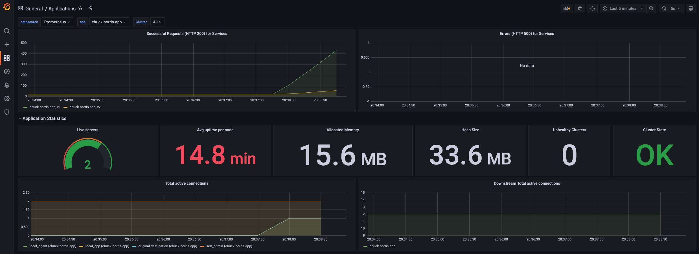
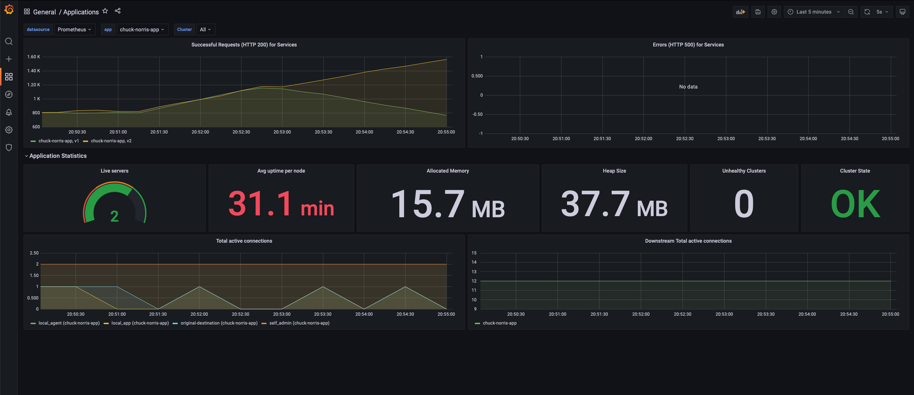
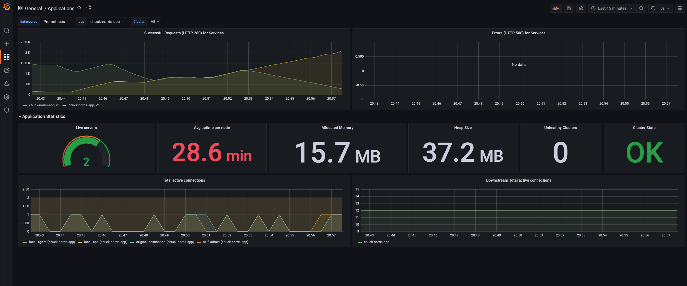

## Introduction
In this part we will be doing following tasks:
- Deploy Consul Service Resolver and Splitter
- Configure Consul Ingress
- Steer traffic from Chuck Norris Application version 1 to version 2

## Blue Green Deployment
Blue green deployment is an application release model that gradually transfers user traffic from a previous version of an app or microservice to a nearly identical new release. To transfer the traffic between two different version we will need to split the traffic. Traffic splitting makes use of configuration entries to centrally configure services and Envoy proxies.

## Deploy Service Resolver and Splitter
Leet's start with Service defaults for the API service to set the protocol to HTTP:
```bash
cat > chuck-norris-app-service-default.yaml <<EOF
apiVersion: consul.hashicorp.com/v1alpha1
kind: ServiceDefaults
metadata:
  name: chuck-norris-app
spec:
  protocol: http
EOF
```

Service resolver which defines which service instances are version 1 and 2:
```bash
cat > chuck-norris-app-service-resolver.yaml <<EOF
apiVersion: consul.hashicorp.com/v1alpha1
kind: ServiceResolver
metadata:
  name: chuck-norris-app
spec:
  defaultSubset: v1
  subsets:
    v1:
      filter: 'Service.Meta.version == v1'
      onlyPassing: true
    v2:
      filter: 'Service.Meta.version == v2'
      onlyPassing: true
EOF
```

We will now create manifest for service splitter. This will define how much traffic will be redirected by Consul to version 1 and how much to version 2. We don’t know how new version will behave so we will be very conservative at the beginning. We will start with 90% of all requests will be redirected to version 1 and 10% will be redirected to version 2.

```bash
cat > chuck-norris-app-service-splitter.yaml <<EOF
apiVersion: consul.hashicorp.com/v1alpha1
kind: ServiceSplitter
metadata:
  name: chuck-norris-app
spec:
  splits:
    - weight: 90
      service: chuck-norris-app
      serviceSubset: v1
    - weight: 10
      service: chuck-norris-app
      serviceSubset: v2
EOF
```

After all manifests have been created let's apply them:
```bash
kubectl apply -f chuck-norris-app-service-default.yaml
kubectl apply -f chuck-norris-app-service-resolver.yaml
kubectl apply -f chuck-norris-app-service-splitter.yaml
```

## Configure Ingress
The final piece we need to configure is the Ingress Gateway. Ingress exposes HTTP and HTTPS routes from outside the cluster to Kubernetes services within the cluster. Traffic routing is controlled by rules defined on the Ingress resource.

In this case we want to tell Consul what service to route to when a client reaches our service via the defined host header. In the spec below, we’ve told Consul’s Ingress Gateway to route any traffic to our `chuck-norris-app` via default URL `chuck-norris-app.ingress.dc1.consul:8080`. This URL is automatically created by Consul. First part contains the name of application, second part defines what object, third part stands for name of our datacenter and last part domain and port.

```bash
cat > chuck-norris-app-ingress.yaml <<EOF
apiVersion: consul.hashicorp.com/v1alpha1
kind: IngressGateway
metadata:
  name: ingress-demo
spec:
  listeners:
    - port: 8080
      protocol: http
      services:
        - name: chuck-norris-app
EOF
```

You can now apply Ingress manifest:
```bash
kubectl apply -f chuck-norris-app-ingress.yaml
```

You can check in Consul dashboard under Services and `ingress-demo` service and upstreams.


## Moving traffic from version 1 to version 2
We have everything in place so we can start steering the traffic from version 1 to version 2. If you remember we have defined the split 90:10. 90% of the traffic will be redirected to version 1 and 10% of the traffic will be redirected to version 2.

We will start with port forwarding of our Consul ingress so we will be able to access the application via `ingress-demo` listening on the port 8080:
```bash
kubectl port-forward service/consul-ingress-demo 8083:8080 -n consul
```

Let's generate HTTP requests to see what version is getting hit. Open the new terminal tab and let's start sending HTTP requests in the loop with `curl`:
```bash
for ((i=0; i<=100000; i++)); do
    curl -v --silent -H "Host: chuck-norris-app.ingress.dc1.consul:8080" "http://localhost:8083" 2>&1 | grep Version
done
```

You can see that most of the time version 1 got hit and only few times version 2. It proves that everything is working in approximately 90:10 ratio.

Go to your Grafana dashboard. You should see that most of the requests are hitting version 1 and only small portion version 2.



We are looking good so now let’s steer more traffic to version 2. We will need to modify service splitter. Let’s modify it with `nano`:
```bash
nano chuck-norris-app-service-splitter.yaml
```

Now let's change the value from 90 to 50 and 10 to 50 so requests will be split 50:50. Save it and apply it:
```bash
kubectl apply -f chuck-norris-app-service-splitter.yaml
```

After few minutes we should see that the amount of requests for version 1 and version 2 are on par:


That’s great! Steering the traffic to the new version works. So now let’s move even more requests to the new version. Let's do same steps like we have done previously but this time let's define that version 1 will response to 10% of requests and version 2 will do 90%. `chuck-norris-app-service-splitter.yaml` file should look like this:
```yaml
apiVersion: consul.hashicorp.com/v1alpha1
kind: ServiceSplitter
metadata:
  name: chuck-norris-app
spec:
  splits:
    - weight: 10
      service: chuck-norris-app
      serviceSubset: v1
    - weight: 90
      service: chuck-norris-app
      serviceSubset: v2
```

Now let's apply the new version:
```bash
kubectl apply -f chuck-norris-app-service-splitter.yaml
```

After few minutes you should see that most of requests are being redirected to version 2:



## Wrapping It Up
In this workshop you've learned the basics of Blue Green Deployment. We have been able move the traffic from version 1 to version 2. You can see here:


Hopefully you had fun, and find this enjoyable!
